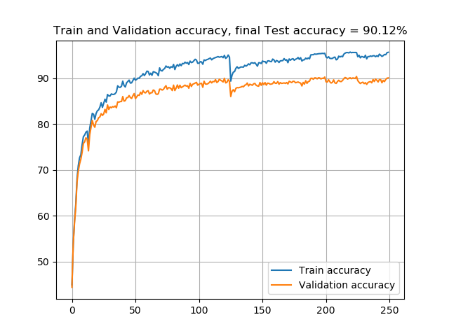
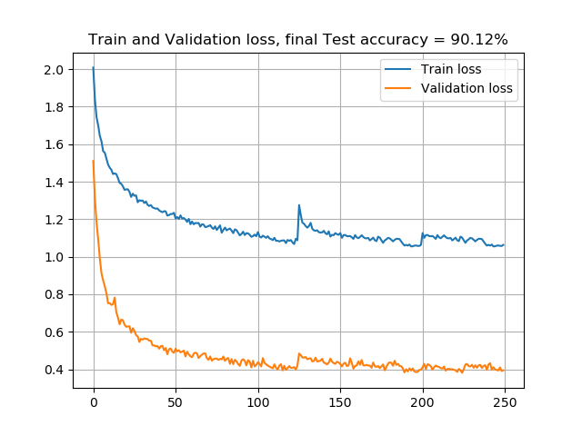

# Optimisation d'un algorithme de classification sous Pytorch en Deep Learning

## Contexte
Aujourd'hui, l'utilisation d'algorithmes de deep learning est devenu une utilisation courante dans un grand nombre d'entreprises, ils sont de plus en plus complexes et demandent un nombre de ressources de plus en plus important. Ce projet prend vie dans ce contexte dans l'objectif de réduire l'empreinte mémoire et le nombre de calculs de ces algorithmes afin d'en réduire les coûts énergétiques et la vitesse de calcul associés. Le réseau mis en place est un ResNet18 sur lequel on appliquera un ensemble de techniques d'optimisation (`pruning`, `quantization`, `factorization`, `data augmentation`), le but étant d'optimiser au maximum l'algorithme tout en restant à une accuracy raisonnable. Le réseau est entraîné pour de la classification d'images sur Cifar10, mais peut-être également utilisé sur Cifar100.

## Versions 
`python` - `3.11.1` \
`numpy` - `1.24.1` \
`pandas` - `1.5.2` \
`pytorch` - `1.13.1` 

## Dataset
Le dataset utilisé est cifar10, il contient 60000 images labélisées réparties de façon uniforme en 10 classes, il est disponible dans la librairie `torchvision.datasets`. 

## Description du modèle 
Le modèle utilisé est le ResNet18 du fichier `resnet_factorized` qui correspond au [travaux de Kaiming He sur le sujet](https://github.com/KaimingHe/deep-residual-networks), mais optimisé avec la technique de `factorization` nommé `grouped convolutions`, qui divise par 8 la taille des filtres. 

## Description des fichiers
`resnet_factorized.py` contient les différents réseaux de neurones resnet (dont le ResNet18), mais factorisé. \
`cifar10.py` ouvre les données de Cifar10, les transforme au moyen de technique de `data augmentation` et les renvoie partagée en données d'entraînement, d'évaluation et de test. \ 
`binaryconnect.py` défini la classe associé à l'algorithme `binaryconnect`, méthode de `quantization`. \
`pruning.py` défini la fonction de la méthode `unsupervised pruning`, méthode de `pruning`. \
`set_mixup_train.py` défini les fonctions de la méthode `mixup`, méthode de `data augmentation`, et la fonction d'entraînement associée. \
`set_cutmix_train.py` défini les fonctions de la méthode `cutmix`, méthode de `data augmentation`, et la fonction d'entraînement associée. \
`set_quantization_train.py` défini la fonction d'entraînement associée à l'algorithme de `binaryconnect`. \

`train.py` est utilisé pour l'entraînement et l'évaluation durant l'entraînement des fonctions de `mixup`,`cutmix` et `quantization` classique. \
`train_pruning.py` est utilisé pour l'entraînement et l'évaluation durant l'entraînement des fonctions de `mixup`,`cutmix` et `quantization` avec la technique du `global pruning`. \
`test.py` est utilisé pour le test. Chaque test est évalué avec la technique de `quantization after training`. 
`profil.py` donne le score en terme d'optimisation, nombre de paramètres supprimés et nombre d'opérations évitées. 

## Entraînement 
Lancer l'entraînement du fichier `train_pruning.py` qui est adapté avec les méthodes donnant les meilleurs résultats d'optimisation : `grouped convolutions`, `cutmix` et `global pruning`. Il est également possible d'entraîner le réseau avec les autres techniques (misent en commentaires).\
Ou télécharger directement le modèle entrainé [ici](https://www.dropbox.com/scl/fo/jkhgykmn42nfe315tzd89/h?dl=0&rlkey=pviatnwma4ng37jcjf4sisxt9).

## Tests
Lancer directement le fichier `test.py` et la fonction `profil.py` pour savoir le score obtenu par l'algorithme. 

## Résultats
Les meilleurs résultats ont été obtenus avec l'entraînement d'un réseau `ResNet18`, avec des `grouped convolutions` de 8, la méthode de `data augmentation` : `cutmix`. Le modèle est entraîné une première fois sur 100 epochs suivit d'un premier `global pruning` à 70%, un second entraînement sur 25 epochs suivit d'un second `global pruning` à 70%, enfin un dernier entraînement sur 125 epochs. Les tests finales sont réalisées avec la méthode de `quantization after training`. 

Entraînement :\
 
 

Test :\
`Accuracy = 0.9012`

Optimisation : 
  Réduction du nombre de paramètre totale de `97%` et du nombre d'opérations totale de `88%` accordé par la fonction `profil.py`. Réduction de la place en mémoire des données de poids du modèle entrainé lors des tests par 2. 

## Références 
Le modèle de ResNet utilisé provient directement des travaux de recherche de Kaiming He, Xiangyu Zhang, Shaoqing Ren et Jian Sun : [Deep Residual Learning for Image Recognition](https://arxiv.org/pdf/1512.03385.pdf). \

La fonction binnaryconnect vient de l'algorithme de Matthieu Courbariaux, Yoshua Bengio et Jean-Pierre David : [BinaryConnect: Training Deep Neural Networks with binary weights during propagations](https://arxiv.org/pdf/1511.00363.pdf). \

L'utilisation du pruning pendant l'entraînement est fortement inspiré du papier : Automatic Network Pruning by Regularizing Auxiliary Parameters, Xiao et al. NIPS 2019. \

Les fonctions mixup et cutmix viennent respectivement des travaux de recherche de Hongyi Zhang, Moustapha Cisse, Yann N. Dauphin et David Lopez-Paz : [mixup: BEYOND EMPIRICAL RISK MINIMIZATION](https://arxiv.org/pdf/1710.09412v2.pdf), et Sangdoo Yun, Dongyoon Han, Seong Joon Oh et Sanghyuk Chun, Junsuk Choe, Youngjoon Yoo : [CutMix: Regularization Strategy to Train Strong Classifiers
with Localizable Features](https://arxiv.org/pdf/1905.04899.pdf). 

Les fonctions d'évaluation du modèle d'un point de vue de l'optimisation ont été faites par les membres de l'équipe de Nicolas Farrugia à sur le technopôle de Brest, à IMT Atlantique lors du cours de Efficient Deep Learning, 2022. 
